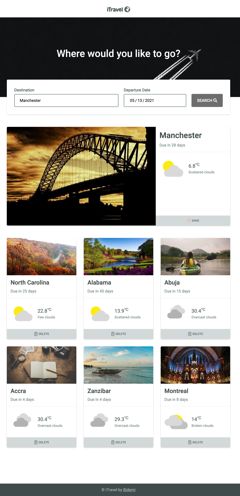

# iTravel (Personal travel app)
## Udacity FEND Capstone Project - Travel App
iTravel is a simple app to plan your trips. It gives real-time weather information, pictures of your destination, and temperature using third-party APIs.



## Installation
### Dev

To run the project on the development webpack server, open the terminal in the root directory and run the command

```
npm install
```
```
npm run build-dev
```
```
npm start
```

### Prod
To run the project on the production server, open the terminal in the root directory and run the command


```
npm run build-prod
```
Then visit your localhost on port `5001` like so - `http://localhost:5001`

## Environment Variables
- `GEONAMES_USERNAME=<username>`
- `WEATHERBIT_API_KEY=<key>`
- `PIXABAY_API_KEY=<key>`

## Technologies
- HTML
- SCSS
- JS
- AXIOS
- Jest
- Webpack
- Babel
- Node
- dotenv

## Contributing
Pull requests are welcome. For major changes, please open an issue first to discuss what you would like to change.

Please make sure to update tests as appropriate.

Also give it a star. I'll appreciate the attention.

## To-do
- Add e2e tests using [Cypress](https://www.cypress.io)
- Increase test coverage to at least 80%
- Add a to-do list for travellers
- Add a reminder for when a saved trip is <= 2 days
- Clear console errors

## License
[MIT](https://github.com/bidemiajala/travel-app/blob/7be020d7fa423b7670b7cc8f43daa3932e0e9468/LICENSE)
